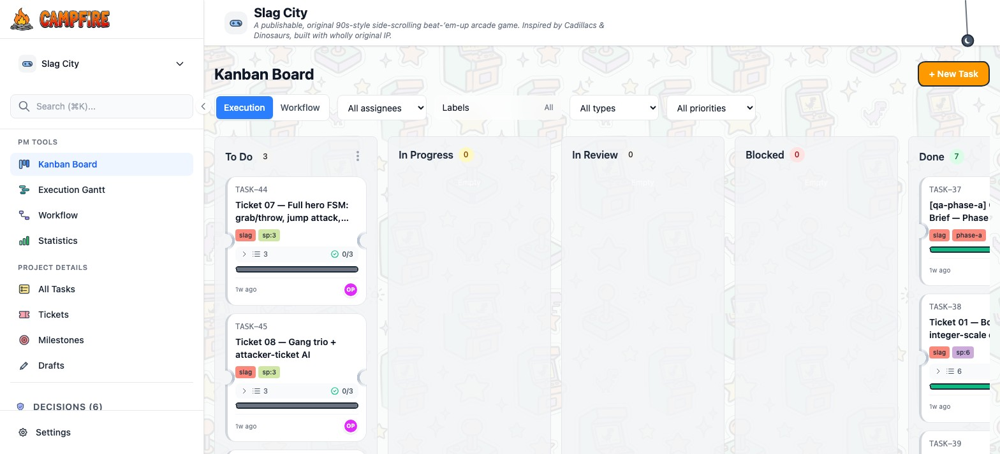
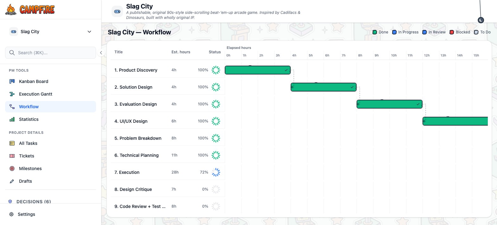
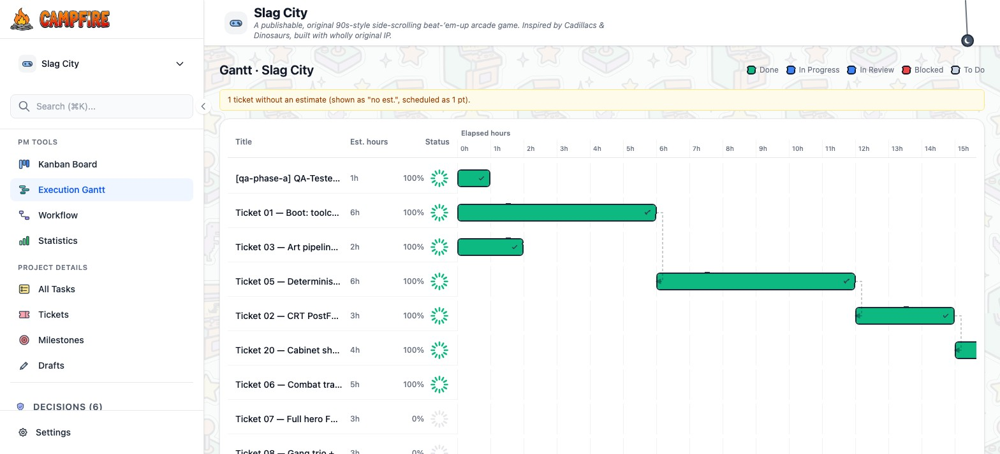
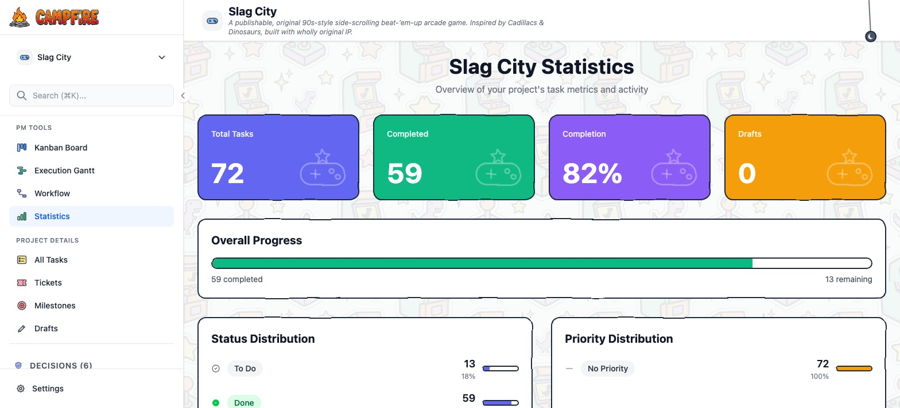

<p align="center">
  
</p>

<p align="center"><strong>A local-first, multi-project management dashboard for the AI build workflow.</strong></p>
<p align="center">Kanban · hours-axis Execution Gantt · build-workflow stages · statistics · project artifacts — all served from a single local binary, backed by plain Markdown.</p>

<p align="center">
  
  
  
</p>

---

**Campfire Board** is a personal fork of [Backlog.md](https://github.com/MrLesk/Backlog.md) reshaped into a
**cross-project command centre**. Every project stays a self-contained folder of Markdown files (tasks,
milestones, decisions, docs), and Campfire renders them all through one dashboard you launch locally in
Chrome. It's the operational home for the 10-stage build workflow — from Product Discovery through
Deployment — so you can see, at a glance, what's planned, what's in flight, and what shipped, across
every project at once.

## Highlights

- **Multi-project switcher** — register any number of `backlog/`-style project folders in a single
  `projects.json` manifest and jump between them from the sidebar.
- **Kanban board** with movie-ticket cards (notched edges, priority accent rail, subtask roll-up
  progress) and an **Execution / Workflow toggle** — flip the same board between your real tickets
  and the 10 build-workflow stages.
- **Execution Gantt** — an hours-axis timeline with dependency arrows, hand-drawn (Excalidraw-style)
  bars, and segmented progress rings.
- **Workflow view** — the build workflow (Product Discovery → Solution Design → … → Deployment)
  rendered as its own board/Gantt, with each stage's status derived from your artifacts and ticket
  progress.
- **Statistics** — a hand-drawn dashboard of totals, completion, and status/priority distribution.
- **Artifacts** — every project's `backlog/docs/` folder, auto-discovered and rendered in-app:
  **Markdown**, **HTML** (sandboxed), and **PDF** (native viewer). Drop a file in the folder and it
  shows up.
- **Light & dark themes**, a doodle-textured canvas, and a `campfire` shell command to launch it.

## Screenshots

### Kanban board — hand-drawn ticket cards, Execution/Workflow toggle


### Workflow view — the 10 build-workflow stages on an hours timeline


### Execution Gantt — hours-axis timeline with dependencies


### Statistics — hand-drawn project metrics


## Getting started

> Prerequisite: [Bun](https://bun.sh).

```bash
bun install
bun run build            # compiles the single `dist/backlog` binary (embeds the web UI)
```

### Run a single project

```bash
cd /path/to/your/project
/path/to/campfire/dist/backlog browser --port 6480
```

### Run the multi-project dashboard

Copy the example manifest and point each entry at a project root (the folder that contains its
`backlog/` directory):

```bash
cp projects.json.example projects.json   # then edit it
dist/backlog browser --projects ./projects.json --port 6480
```

The dashboard is served at **http://127.0.0.1:6480**.

### The `campfire` command

A small zsh function (`~/dotfiles/zsh/.zshrc`) starts the server if it isn't running and opens the
dashboard in Chrome:

```bash
campfire
```

## How it works

- **Storage is Markdown.** Tasks, subtasks, milestones, decisions, and docs live as files under each
  project's `backlog/` directory — Git-friendly, diffable, and readable without the app.
- **One binary.** Campfire is a Bun-compiled CLI that serves a React + Tailwind single-page app; the
  web UI is embedded in the binary, so there's nothing to deploy.
- **Artifacts are just files.** The Artifacts section globs `backlog/docs/**/*.{md,html,htm,pdf}` — no
  registration needed. Markdown renders with mermaid + syntax highlighting; HTML renders in a
  sandboxed, origin-isolated iframe; PDF opens in the browser's native viewer.

## Development

```bash
bun run cli browser --port 6480 --no-open   # dev server
bunx tsc --noEmit                            # type-check
bun run check .                              # Biome format + lint
bun test                                     # test suite
```

See [`docs/BUILD.md`](./docs/BUILD.md) for the full build & test notes.

## Credits & license

Campfire Board is a fork of **[Backlog.md](https://github.com/MrLesk/Backlog.md)** by Alex Gavrilescu
and contributors, and inherits its Markdown-native, agent-first philosophy. Licensed under the
[MIT License](./LICENSE).
